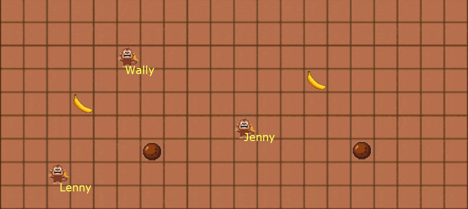

# Visualization

Die Visualisierungs-Komponente dient dazu, den ganzen Spielverlauf im Junglecamp für Zuschauer live darzustellen. Die verschiedenen Spieler sollten identifizierbar sein und deren Bewegungen und Aktionen zu erkennen sein.

## Mockup

## Technical Design

Die Visualisierung wird als Web-App implementiert. Die App wird von einem dedizierten Pfad des Game-Servers (`/visualization/`) geladen. Daten über die Spiele werden durch das folgende REST-API zur Verfügung gestellt:

Endpoint | Parameters | JSON Response | Example
-------- | ---------- | ------------- | -------
`/visualization/list` | *none* | `{ "games": [game URLs...] }` | <code>{   "games": [     "/visualization/game/123",     "/visualization/game/42"    ]  }</code>
`/visualization/game/<game_id>` | *game_id*: Game-Id, wie von `/list` zurückgegeben. | <code>{ "id": <game_id>, "state": <game_state> "cells": <array of strings> }</code> | <code>{   "id": "123",   "state": "playing",   "cells": [      "WWWWWWWWWWWWWWWWWWWWWWW",     "WW   P               WW",     "WW             12    WW",     "WW    08   C         WW",     "WWWWWWWWWWWWWWWWWWWWWWW"   ],   "players": {      "12": {       "id": "123",       "name": "Wally",       "lives": 3,       "ammo": 2      }, ... }</code>

### Identifiers
Alle Identifier können beliebige Zeichenketten sein (also nicht nur Zahlen).

### Cell JSON
Jede Zelle des zweidimensionalen Spielfelds wird durch zwei Characters im String der jeweiligen Zeile codiert:

Name | Beispiel | Beschreibung
---- | -------- | ------------
leer | `"  "` | Leere Zelle
Wand | `"WW"` | Undurchdringliche Wand
Ananas | `" P"` | Ananas Token
Kokosnuss | `" C"` | Kokosnuss Token
Spieler | `"08"` | Spieler-Id. Die Id ist nur eine Visualisierungs-Id und dient als Schlüssel im "players"-Objekt.

Die Informationen zu jedem Spieler unter der Visualisierungs-Id im `players`-Objekt unter folgenden Attributen abgelegt:

Name | Beispiel | Beschreibung
---- | -------- | ------------
`id` | `"123-ab"` | Eindeutiger Identifier des Spielers
`name` | `"Wally"` | Ein selbstgewählter Namde des Spielers
`lives` | 4 | Verbleibende Lebensenergie des Spielers. Eine Energie von 0 bezeichnet ohnmächtige Spieler.
`ammo` | 3 | Verbleibende Kokosnüsse des Spielers.
`action`| `"move"` | Rundenaktion des Spielers. Mögliche Werte: <code>move, throw</code>
`direction` | `"left"` | Richtung der Rundenaktion. Mögliche Werte: <code>left, right, up, down</code>
`event` | `"powerup"` | Rundenereignis des Spielers. Mögliche Werte: <code>powerup, ammoup, hit, boink</code> (`boink` bezeichnet einen Zusammenstoss)

### Authentication

Alle Anfragen an das Visualisierungs-API müssen authentifiziert werden, um zu verhindern, dass die Spielfeldinformation von böswilligen Teilnehmern misbraucht werden kann. Die Index-Seite enthält dafür ein Passwort-Feld, in das das Visualisierungs-Passwort eingegeben werden muss. Im Server wird das gehashte Passwort mit einem hartcodierten (oder auf der Kommandozeile gegebenen) Hash verglichen und ein 403 zurückgegeben, wenn es ungültig ist.

### Nice to have

Folgende Dinge sind nicht zwingend, aber lohnenswerte Erweiterungen:
* Animation der Rundenaktionen & -ereignisse der Spieler
* Sounds bei bestimmten Ereignissen (Treffer, Tokens, Zusammenstoss)
* Skinning: wählbare Themes für das Spielfeld (Urwald, Pacman...)
